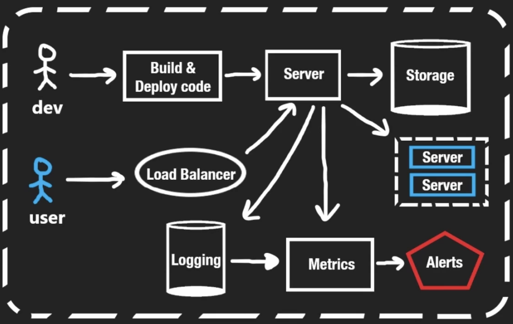

# System Design Background Info

## Computer Architecture
- CPU: central processing unit, brain
    - reads/writes with various storage devices 
- Cache: memory part of CPU
    - fastest, but most expensive so its limited to MB
    - L1, L2, L3
- RAM: random access memory
    - significantly faster than disk, smaller limited to GB
- Disk: persistent storage
    - largest, can be up to TB

Upgrading one computer to improve scale and performance is a limited option. Think how Moore's Law (# of CPU transistors double every two years) is plateuing. Then, how can we utilize multiple computers to create scalable systems? The parts mentioned above have significant overlap...

## Application Architecture

#### Basics for the Developer
- Building and deploying code (after testing it in the CI/CD pipeline)
- App runs on a server that *serves* the user's requests
- Persistent storage (e.g. a database) that the server may need

What if the single server can't keep up with all the user requests?
1. Vertical scaling: upgrade the server's parts
2. Horizontal scaling: add more servers

We might also want some failover system, or have servers close to all global users.

Obviously horizontal scaling is better because it avoids the limitations of having only one server. We can always add more servers, and hence more computing resources! But this introduces a new problem, how do we know which server to route the user to? 

- Load Balancer
    - Route the user request to the server that has the minimum resources being used

#### Additional Developer Services:
- Logging
    - with each user request to the server, store the request/response data as well as server resource usage
- Metrics
    - produced from the logging storage, store the usage of the resources on that server (CPU/RAM/Disk)
- Alerts
    - the developer can check both of these, but also wants to be alerted immediately when something goes wrong with the server, e.g. only 95% of users are getting successful responses. Push-based unlike the other two.