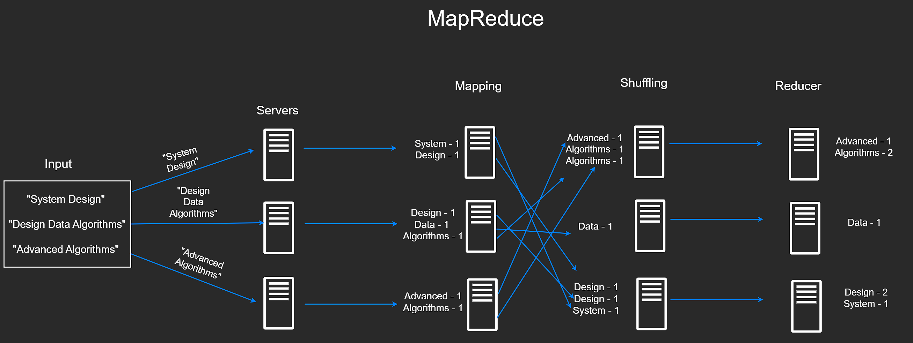

# Big Data

## Message Queues
In situations where a server is receiving too many requests, we could horizontally or vertically scale. But this isn't always necessary/cost-efficient. If the requests do not need to be processed immediately, the system can leverage a **message queue**. Message queues decouple producers (app events) and consumers (application servers), functioning as a buffer for managing surges in data. They are also durable.

Servers at peak times can leverage message queues to avoid prolonged wait times and potential timeouts by storing the requests and processing them asynchronously.

### Push/Pull Model
Focusing on how data gets transferred to the processing server, message queues can either be push or pull based. For either strategy though, messages are ensured to be delivered because the server will send an acknowledgement that it received it to the queue. Similar to TCP packets, the queue will continue to send messages until it receives this ACK.

#### Pull-Based
The application is responsible for monitoring the message queue and pulling in new messages to process. If the server has capacity, it will check and pull. A key benefit is that the server never gets overloaded.

#### Push-Based
The queue is responsible for sending new messages to the server. However, this can overload the server.

### Pub/Sub Model
Short for publisher/subscriber model, Pub/Sub is a variation of message queues. "Publishers" dispatch their messages to specific topics, and "subscribers" indicate their interest by subscribing to these topics. A "topic" is a category or label that serves as a conduit for similar messages. Pub/Sub systems are very flexible and scalable: you can easily add new subscribers to a topic without having to change to the publishers at all. Can be either pull/push based. A key difference from regular message queues is that multiple servers can receive the data.

## Big Data Processing
**Batch processing** works with collected historical data at set intervals, while **stream processing** operates continuously on incoming data as it flows through the system. The choice between them typically depends on whether real-time processing is necessary for the specific use case.

### MapReduce
A fault-tolerant method of processing large amounts of data in a parallel manner. 

1. Master Node: This node is tasked with managing the distribution of the MapReduce job across the worker nodes. It keeps an eye on the status of each task and re-assigns tasks if any failures occur.

2. Worker Nodes: These nodes are the venues where the actual data processing takes place. The master node assigns each worker node a portion of the data and a copy of the MapReduce program.

3. Map Phase: Each worker node executes the Map operation on its assigned data portion. In our scenario, this would entail mapping each word to a key-value pair where the key is the word, and the value is frequency of the word.

4. Shuffle and Sort Phase: Following the Map phase, the worker nodes reorganize the key-value pairs so that all values associated with the same key are grouped together. This process is known as the shuffle and sort phase. So, for instance, given the word "The", if worker 1 processed 3 occurrences, worker 2 processed 7, and worker 3 processed 100, these would be grouped together during this phase.

5. Reduce Phase: The Reduce operation is performed on each group of values, producing a final count for each word. This result is then written to some form of storage or database.

Because of its strict model, MapReduce is limited to processing data that fits into Map-Reduce steps. It also has alot of I/O overhead, a restriction that the modern Apache Spark has improved upon. Also its critical weakness is: if the master node crashes, the whole system crashes!