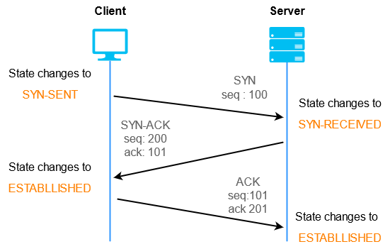

# Networking
How do two computers actually communicate?

## Basics
IP (Internet Protocol) is a set of rules that defines how data is sent across the internet. It is helpful to think of sending envelopes as an analogy. There must be a FROM and a TO address. These are represented as **IP Addresses**, unique numeric identifiers for each computer. These can be 32-bit (IPv4) or 128-bit (IPv6). They can be public (reachable from any device on internet) or private (only accessible thru local area network, LAN, think home networks). They can also be static or dynamic (typically only clients). 

Imagine there is only the envelope system, and someone wants to send their friend a book. One approach would be to tear up the book into individual pages and send each one in its own envelope. Similarly, when one computer wants to send a large amount of data, it is broken up into **packets**. In each packet, there is header info and data. The header is known as the *IP Header* because it contains the IP addresses. Unlike books, packets do not contain page numbers. So how do we ensure the correct order on the receiving end?

**TCP**, transmission control protocol, ensures packets can be reassembled in the right sequence, and that all reach their destination reliably. TCP does this by adding a sequence number to each packet in the *TCP Header*. 

The IP layer can be thought of as the network layer, while the TCP layer can be thought of as the transport layer. But as developers, we are mostly interested in the application layer, which is the data. Typically, HTTP is the protocol used at this layer. The TCP packet's data contains the HTTP header and its payload (data). 

How do we address a specific service running on a computer that is running several? The IP address is not enough, we use also a **port** number. There are a few reserved ports: 443 for https, 80 for http...

## TCP vs UDP
TCP: uses a 3-way handshake to ensure all packets arrive. After the connection is established, birdirectional communication can begin. If a data packet is sent and doesn't receive an acknowledgement, TCP assumes it wasn't received and triggers a retransmission.

UDP, User Datagram (Packet) Protocol: is much faster because it does not ensure all packets arrive, and has less overhead. It used where speed and efficency is important than reliability, think live streaming, online gaming.

But as developers, we are mostly concerned with the application layer that rests atop TCP, like HTTP (but there is also SMTP, FTP).

## DNS
Domain Name System: "internet's phone book." It maps domain names to IP addresses. To speed up lookups, the client will cache static IP addresses.

To summarize, a server refers to a computer equipped with a public IP address and a domain name. It is configured with firewalls to handle public requests. When a client sends a request to a server, the server receives the request and responds accordingly. 