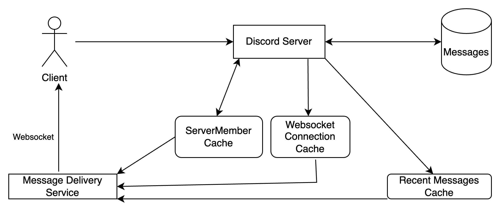

# Design Discord

## Functional Requirements
What exactly should the system do?

Allow messaging between two people (DM service).
Users can join servers, receive all messages from that server in real-time. Messages should be persisted.

## Non-Functional Requirements
Scale, performance, latency, consistency needs

Messages should be delivered very fast. Messages guaranteed to deliver. Should scale well, lots of messages/users/servers.

## Scale
Reads/Writes/Requests per second, read/write ratio, data volume

More reads than writes. 10:1 read/write ratio average. 1000 writes per second. 10000 reads per second. 1000 bytes per write. 1B Users. On average, one user is in 10 servers.

### Envelope Math
8 Bytes for user_id, 8 bytes for server_id. 10B user->servers. 16 bytes * 10B records = 160B bytes = 160GB. Cache!

## System Interface Definitions
joinServer(user_id, server_id)

postMessage(user_id, server_id, message)

loadMessages(user_id, server_id, limit, offset)

## Defining Data Model
Messages: poster_id, server_id, content, timestamp

ServerMembers: user_id, server_id

## High-Level Design
