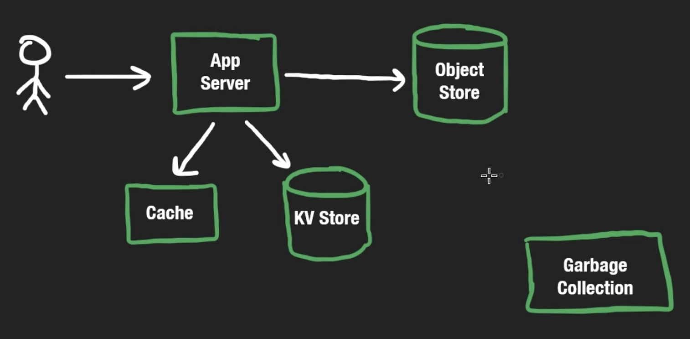

# Google Drive

## Functional Requirements
Virtual file system. Users can upload, remove, or download files in a hierarchical manner.

Out of scope for interview (probably): share links with other users

## Non-Functional Requirements / Scale
TONS of users all having free tier 10GB. TONS of requests every second. 
200M total users. 15GB free storage each. 200M * 15 Billion Bytes = 3000PB.
System must also be **very** reliable, will need backups of data.

A user uploads on average 2 files / day, with an average file size of 10MB. Read/Write ratio is 2:1. 

Latency not the main focus. **Availability** and **reliability** most important.

## High-Level Design
Using Object Store gives us reliablity by default, allows us to store all types of files. Files are immutable in object-stores. We could use a distributed file-system, but it could get much more complicated and less scalable. We can create the folder-like display by including that in the metadata key-value store. This would probably be a NoSQL database. 

An interesting optimization is de-duplication. Imagine we have multiple users uploading the same files. We don't want to have copies of the same file. We could instead hash the contents of the file to see if it already exists, and instead of creating it again, we can add a reference to a list of users that have it. We could also break each file into chunks, and avoid creating copies of chunks as well.
