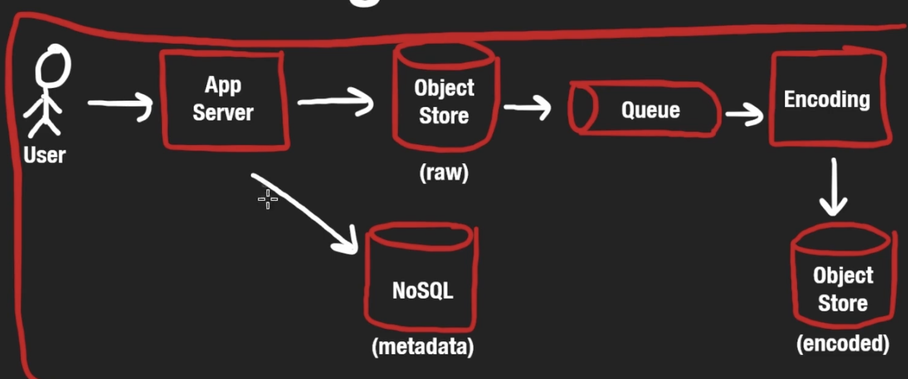
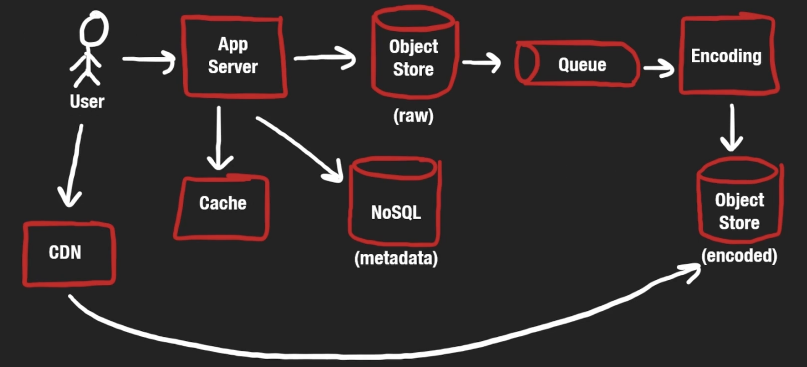

# YouTube

## Functional Requirements
Users can upload videos. Users can watch videos.

Out of scope for an interview (probably): recommended content, subscriptions, comments/likes, search

## Non-Functional Requirements
"Real-time" streaming (low latency), high avaliablity, durability (videos don't get lost). Scalable: you can have thousands of people streaming the same video at once.

## Scale
1 Billion daily active users. A user watches on average, let's say 5 per day. Watch/upload ratio is 100:1.

5 billion videos watched per day. 50 million uploads per day.

## System Interface Definitions
WebSocket for getting videos

upload(title, description, video, uid)

## High Level Design
Video Upload: YouTube wants to compress videos as much as possible, so there is an additional *asynchronous* encoding process that utilizes a message queue. Also, to store metadata we can use a NoSQL database. 

Video Watching: YouTube doesn't want to return the entire video all at once, what if a user clicks off before the video finishes or has to wait a really long time to load all of it? Load it in chunks using HTTP. Also, we can use CDNs to get the content quicker.

